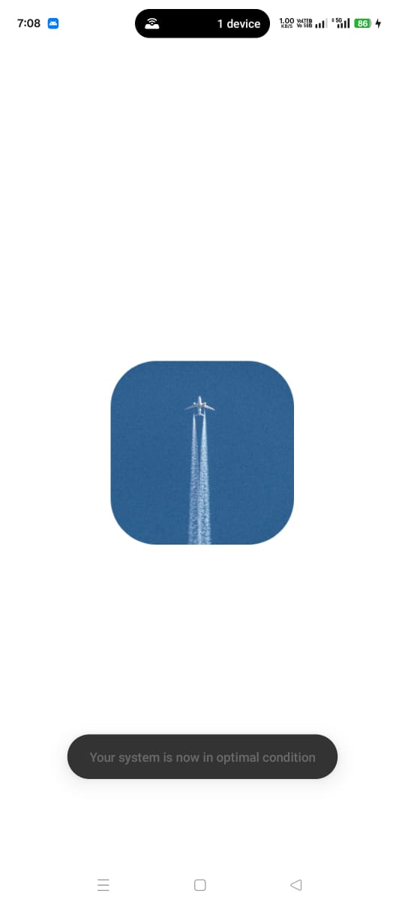
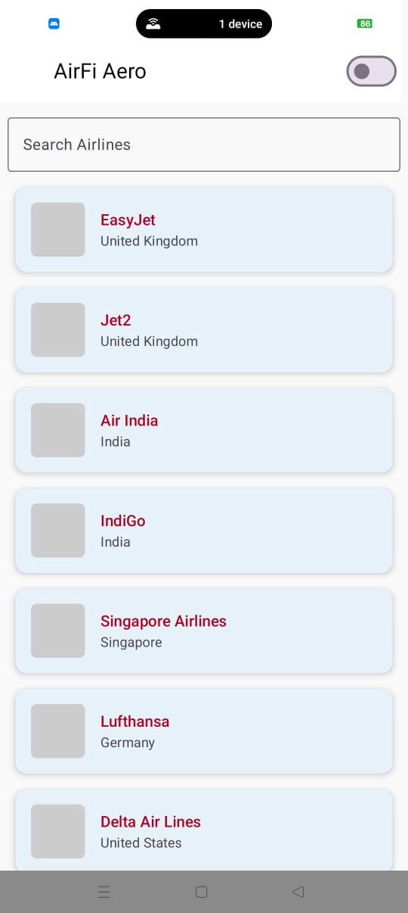
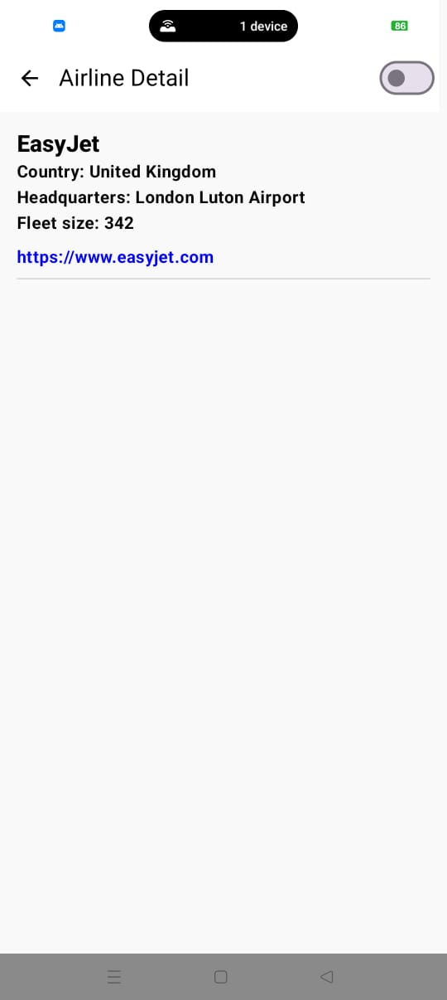
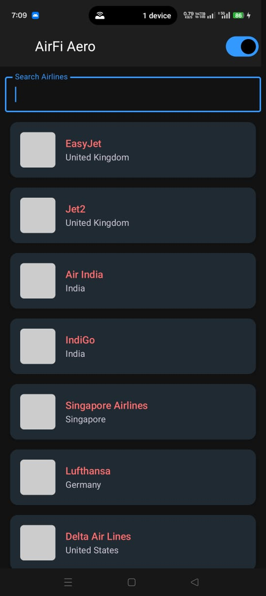
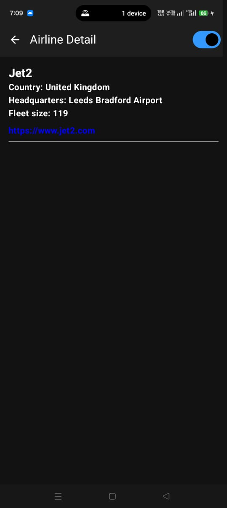
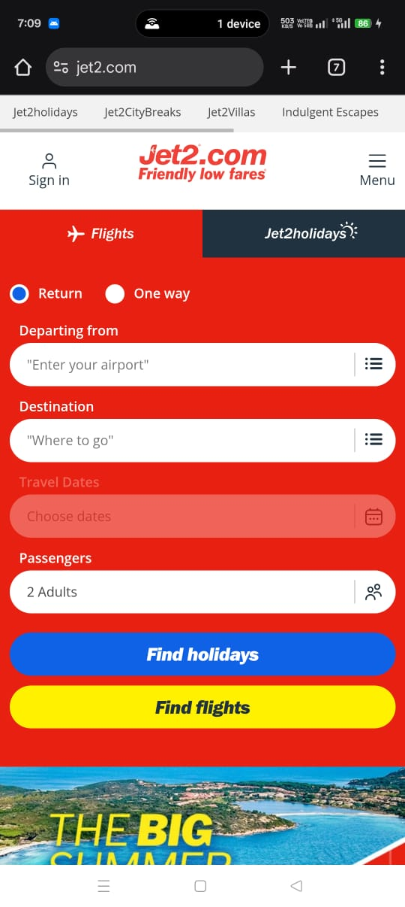

# ✈️ AirFiAero

## Overview
A modern Android app that showcases airline listings and details with network fetching, clean architecture, Jetpack Compose UI, and robust offline/error handling. The project is designed with scalability and best practices in mind, including multi-module structure, MVVM, and dependency injection.

---

## 🚀 Build & Run Instructions

1. Clone this repo
```bash
git clone https://github.com/Nikhil-Mandle/AirFiAero.git
```
2. Open the project in Android Studio Hedgehog or later
3. Make sure local.properties has a valid sdk.dir
4. Build & Run on an emulator or device with internet access

## 🌐 Simulated Network Call
Endpoint used: https://raw.githubusercontent.com/Nikhil-Mandle/AirFiAero/main/airlines.json

## 🧪 Features Implemented
✅ Multi-module clean architecture
✅ Modern Jetpack Compose UI
✅ MVVM with ViewModel & StateFlow
✅ Retrofit for HTTP requests
✅ Coil for async image loading with fallback
✅ Hilt for dependency injection
✅ Type-safe Navigation
✅ Network availability check before fetching
✅ Error UI when offline
✅ Search functionality
✅ Light & Dark theme support

## ✨ Optional Bonus Features Implemented
🔍 Search airlines by name using reactive filtering
🌗 Dark mode support with Material You theming
🏁 Splash Screen implemented as the app entry point

## 🏗️ Architecture Overview

The app is built using Clean Architecture with a multi-module MVVM pattern. It separates concerns into the following layers:

Presentation Layer – Jetpack Compose UI, ViewModel, Navigation

Domain Layer – Use cases, models, repository interfaces

Data Layer – Retrofit network layer, DTOs, repository implementations

Each module encapsulates its responsibility, promoting testability, scalability, and clean dependency management.


## 🧰 Tools & Libraries Used
The application follows Clean Architecture principles with a multimodule structure to ensure scalability and maintainability.

**Jetpack Compose** – Modern declarative UI toolkit

**Coil** – Image loading with error placeholder support

**Hilt** – Dependency injection framework from Android Jetpack

**Retrofit** – Type-safe HTTP client for network communication

**Kotlin Coroutines** – Asynchronous programming for flow-based and suspendable APIs

**Jetpack Compose Navigation** – Type-safe navigation between composables

**Multi-module Clean Architecture** – Separation of concerns across data, domain, and presentation layers

**Network Connectivity Monitoring** – Using ConnectivityManager to observe real-time internet status

**Error Placeholder in Coil** – Enhances UX when image loading fails

## ⚙️ Possible Improvements
📁 Add offline caching using Room or DataStore
💾 Save favorite airlines locally
🧪 Add UI & Unit tests for ViewModel and business logic

## 📸 Screenshots








---

▶️ [**Watch Demo Video on Google Drive**](https://drive.google.com/file/d/1ju8wpX5YCZx6mbo-i6uGtZELI9oZWB9a/view?usp=sharing)
